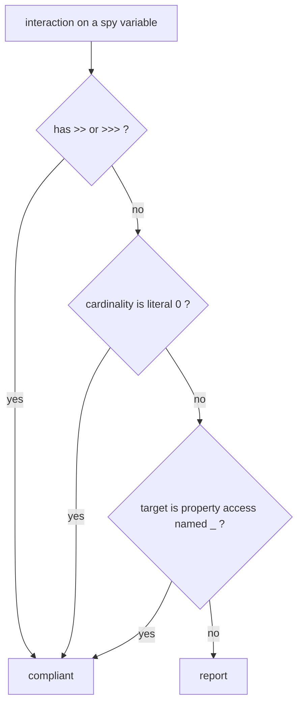

## Context

Three conventions, one existing rule to extend and two new rules. All three read machinery that
already exists: `AbstractSpockRule` for the specification gate, `AbstractSpockBlockVisitor` for the
block partition, `SpockInteraction` for what `*` and `>>` mean.

```
bullet                            rule                              kind
────────────────────────────────  ────────────────────────────────  ─────────
@Shared / static double           AvoidSharedOrStaticMock           new
Type x = Mock(Type)               DeclareMockWithExplicitType       extended
spy interaction without >>        RequireSpyInteractionResponse     new
```

The one non-obvious interaction is with `RequireSpyEntryInteraction`, which *requires* `1 * spy._` —
an interaction on a spy with no response. The new rule must not contradict it.

## Goals / Non-Goals

**Goals:**

- Each convention independently selectable.
- The new spy rule and the entry rule agree on every input: nothing the entry rule demands is
  reported by the response rule.
- Under-report rather than guess, as in the rest of the family.

**Non-Goals:**

- Detecting `setupSpec() { shared = Mock() }`. The field has no initialiser to inspect, and catching
  the assignment means tracking writes to annotated fields across methods.
- Recognising a spy that does not come from a visible `Spy(...)` declaration.
- Rewriting `RequireSpyEntryInteraction`'s behaviour or messages.

## Decisions

### 1. `AvoidSharedOrStaticMock` is a field rule over all three factories

The rule visits fields. A field is reported when it is `@Shared` (simple name `Shared` or
`spock.lang.Shared`, matched as written) or has the `static` modifier, **and** its initialiser is a
`Mock`/`Stub`/`Spy` call by name.

`Spy` is included although the request named Mock and Stub: the reasoning — a double that outlives
the feature method is outside the scope Spock verifies interactions in, so strict mocking cannot hold
for it — applies identically. The factory-name set is reused from `DeclareMockWithExplicitType` rather
than restated.

Alternative: fold into `DeclareMockWithExplicitType`. Rejected — that rule is about the type written
on the left; this one is about field scope. Two concerns, and a consumer may want one without the
other.

A non-private field is both a property and a field in the AST, so the visitor guards against reporting
the one declaration twice, as `DeclareMockWithExplicitType` already does for locals.

### 2. Redundant type is extended into the existing rule, and only on equal types

`DeclareMockWithExplicitType` already owns "the type is written on the left and nowhere else". The new
condition is the other half of the same sentence: a *typed* declaration whose factory call's first
positional argument names the declared type.

Equality is on the type's name, with generics ignored (`List<String> l = Mock(List)` is reported).
A differing type is silent: `Collection<String> c = Mock(List)` needs the argument, because Spock
cannot infer a concrete class from an interface-typed variable.

CodeNarc does not resolve the source: `Mock(TypeMirror)` arrives as a `VariableExpression`, a
qualified or `.class` form as a property chain, and a `ClassExpression` never occurs (mutation
analysis showed that branch unreachable). Comparing the argument's name against the declared type's
makes that irrelevant: a variable called exactly like the declared type is, in a Spock specification,
the class. Names are compared as written — equal, or one the dotted-suffix of the other — so an import
deciding which is written does not matter, while `java.util.List` and `java.awt.List` stay different.

`Spy(realInstance)` is silent: the argument is an instance, never a type. `Spy(Type, constructorArgs:
[...])` is reported; the fix is `Spy(constructorArgs: [...])`.

The rule name is kept. Renaming would break every ruleset that names it, and "explicit type" still
describes the intent.

### 3. `RequireSpyInteractionResponse` exempts exactly `spy._`

The exemption is the same node shape `RequireSpyEntryInteraction` already treats as the entry
interaction: a property access whose property is literally `_`. Nothing wider:



- `1 * spy._(arg)` is a method call named `_`: a filter over every method's argument, so it can call
  real code for methods nobody named. Reported.
- A regex-matched method name is a method call and is reported.
- `0 * spy.foo()` never executes, so nothing can call through. Exempt.
- `_ * spy.foo()` and `(1..3) * spy.foo()` are reported like `1 *`.

The exemption does not read the cardinality on `spy._`: `RequireSpyEntryInteraction` deliberately
does not either (`2 * service._` is a spy entered twice), and the two rules must not disagree.

### 4. Spy recognition is extracted, not duplicated

Both spy rules need "the variables in scope that were initialised from `Spy(...)`": fields on the
class plus locals in the feature method. That logic currently sits inside
`RequireSpyEntryInteractionRule`'s visitor. It moves into one package-private helper used by both, the
same way `SpockInteraction` is shared. Behaviour of the entry rule is unchanged and its specification
is the regression test.

`SpockInteraction` gains `isCounted`, `isNeverCalled` and `isEntryCall`. No separate "has a response"
question was needed: `cardinalityOf` already reads the expression "as written", so a stubbed
interaction exposes no cardinality and "counted" already means "states no response". The factory-call
recognition (`MockFactories`/`MockCall`) is shared by the three rules that read a `Mock`/`Stub`/`Spy`
call.

### 5. Scope of "an interaction on a spy"

Top-level statements in any block whose `SpockInteraction` is present, has a counted form, and whose
receiver is a recognised spy variable (method call, property, or the bare variable). Interactions
inside an `interaction { }` closure are not visited — the same boundary the argument rule documents.
Which *block* the statement sits in is not this rule's concern; `InteractionsBelongInThenBlock` owns
that, and each rule stays correct alone.

## Risks / Trade-offs

- [`DeclareMockWithExplicitType` reports more than before, in a rule consumers already selected] →
  the README states it; the type-equality condition keeps false positives to the cases the user
  listed.
- [A spy from a helper, base class or parameter is invisible] → the family's standing posture; the
  rule stays silent rather than demand a change it cannot verify.
- [`1 * spy._` stays a silent call-through] → deliberate: it is the one self-call `when:` makes, and
  requiring `>> { callRealMethod() }` there was considered and declined.
- [`@Shared` matched by name] → a different annotation also called `Shared` is matched; accepted for
  the reason `AvoidUnrollAnnotation` accepts it.
- [`setupSpec` assignment is not caught] → documented as a gap, not closed.

## Open Questions

- Does the `spock-coding-conventions` skill (outside this repository) need the two new conventions
  added to its checklist? Out of scope here; flagged for the maintainer.
